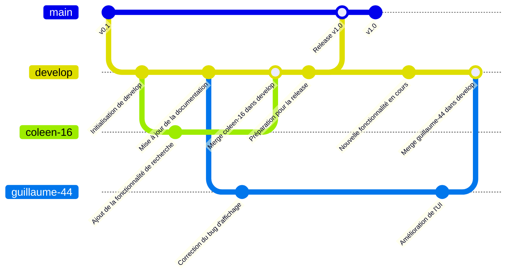

# **Leodys** 🌟
**Une application mobile inclusive pour faciliter l’apprentissage et le quotidien des personnes avec des troubles DYS.**

---

## **📜 Contexte et Objectifs**
### **Contexte**
Les troubles de l’apprentissage (dyslexie, dyscalculie, dyspraxie, TDAH, etc.) rendent difficile l’utilisation des méthodes traditionnelles.  
**Leodys** propose des outils personnalisés pour **faciliter l’autonomie, la confiance et l’inclusion** des utilisateurs.

### **Objectifs**
✅ **Support pédagogique adapté** : Outils pour lire, écrire, calculer et organiser.  
✅ **Améliorer l’autonomie** : Fonctionnalités conçues pour renforcer la confiance.  
✅ **Personnalisation** : Adaptation aux besoins spécifiques de chaque utilisateur.

---

## **👥 Public Cible**
- **Enfants et adolescents** avec des troubles de l’apprentissage.  
- **Parents et éducateurs** cherchant des outils pour accompagner ces personnes.  
- **Adultes** ayant besoin de soutien dans leur quotidien (professionnel ou personnel).

---

## **📋 Spécifications Fonctionnelles**
### **Fonctionnalités Principales**
| ID  | Fonctionnalité                                                                                             | Statut       |
|-----|------------------------------------------------------------------------------------------------------------|--------------|
| 1   | Ouverture de l’application par empreinte digitale                                                          | 🟢 Prioritaire |
| 2   | Personnalisation du profil (nom, prénom, téléphone, email, avatar)                                         | ⚪ Secondaire |
| 3   | Lecture audio par synthèse vocale pour les textes scannés (compatible avec la dyslexie)                    | 🟢 Prioritaire |
| 4   | Calculatrice visuelle pour la dyscalculie                                                                  | 🟢 Prioritaire |
| 5   | Reformulation du texte par IA en cas d’incompréhension, par synthèse vocale                                | ⚪ Secondaire |
| 6   | Reconnaissance des 80 formes domestiques via caméra (temps réel + synthèse vocale)                         | ⚪ Secondaire |
| 7   | Chat vocal avec IA (réponses par synthèse vocale)                                                          | ⚪ Secondaire |
| 8   | Stockage crypté de fichiers confidentiels (carte d’identité, permis, carte grise, assurance, etc.)         | 🟢 Prioritaire |
| 9   | Bloc-notes avec **SpeechToText** et **TextToSpeech**                                                       | 🟢 Prioritaire |
| 10  | Accès à une liste de podcasts (France Culture, France Inter) + ajout personnalisé                          | ⚪ Secondaire |
| 11  | Lecture vocale des informations des sites **service-public.gouv.fr**, **agefiph.fr**, **handicap.gouv.fr** | ⚪ Secondaire |
| 12  | Saisie des cartes d’abonnement (Kiabi, Carrefour, Leclerc) par photo                                       | 🟢 Prioritaire |
| 13  | Cartographie et itinéraires (géolocalisation)                                                              | 🟢 Prioritaire |
| 14  | Notifications aux référents handicap (générique)                                                           | 🟢 Prioritaire |
| 15  | Notifications au référent **CAP Emploi**                                                                   | 🟢 Prioritaire |
| 16  | Notifications au référent **AGEFIPH**                                                                      | 🟢 Prioritaire |
| 17  | Gestion de l’agenda (intégration Google Agenda : ajout/modification/suppression d’événements)              | ⚪ Secondaire |
| 18  | Alarmes vocales pour les événements                                                                        | ⚪ Secondaire |
| 19  | Lecteur OCR pour reconnaître tout type de texte (y compris manuscrit)                                      | 🟢 Prioritaire |
| 20  | Module de gestion des dépenses (espèces, Google Pay) + aide à la manipulation de monnaie                   | ⚪ Secondaire |
| 21  | Lecteur OCR pour reconnaître les tickets de caisse et enregistrer les informations                         | 🟢 Prioritaire |
| 22  | Lecteur OCR pour reconnaître les cartes d’un jeu de cartes traditionnel                                    | ⚪ Secondaire |
| 23  | Lecture de l’heure par synthèse vocale                                                                     | 🟢 Prioritaire |
| 24  | Module pour éviter la confusion droite/gauche                                                              | 🟢 Prioritaire |
| 25  | Lecteur OCR pour reconnaître le modèle et le type de véhicule via plaque d’immatriculation                 | ⚪ Secondaire |
| 26  | Forum pour partager des conseils et témoignages entre utilisateurs                                         | ⚪ Secondaire |

---

## **🛠 Spécifications Techniques**
### **Technologies Utilisées**
- **Plateformes** : Android, Windows, Web.
- **Langage** : **Flutter** (pour une application multiplateforme).
- **Base de données** : **Sqflite** (local), **Hive** (NoSQL), **Supabase** (PostgreSQL pour le cloud).
- **APIs** :
    - Synthèse vocale : **Flutter TTS**.
    - Reconnaissance vocale : **SpeechToText**.
    - OCR : **Tesseract** ou **Google ML Kit**.
    - Reconnaissance de formes : **YOLO (Ultralytics)**.
    - Authentification : **Supabase Auth**.
- **Déploiement** : Google Play, Amazon Underground, Web.

---

## **🎨 Design et Ergonomie**
- **Interface intuitive** : Navigation simple et épurée.
- **Couleurs douces** : Éviter les distractions visuelles.
- **Polices adaptées** : Sans serif (Arial, Helvetica).
- **Retour vocal optionnel** : Pour guider l’utilisateur.

---

# 📜 Règles de Contribution et Structure des Branches

Ce projet suit un **workflow Git strict** pour garantir la qualité du code.
**Toute contribution doit respecter les règles suivantes.**

---

## 🔄 Structure des Branches



## 🛠 Installation et configuration

### 📥 Prérequis
- **[Flutter SDK](https://flutter.dev/docs/get-started/install)** (version ≥ 3.38.5).  
- **[Android Studio](https://developer.android.com/studio)** (avec le plugin **Flutter** activé).

### 1. Cloner le dépôt
```bash
git clone https://github.com/CDA6/leodys.git
```

### 2. Initialiser le projet Flutter
```bash
cd leodys
flutter create --platforms android,windows,web .
```

### 3. Installer les dépendances
```bash
flutter pub get
```

Vous pouvez ouvrir le projet depuis Android Studio et l’exécuter pour vérifier son bon fonctionnement.
En cas de problème, n’hésitez pas à ouvrir une discussion sur le dépôt GitHub 
